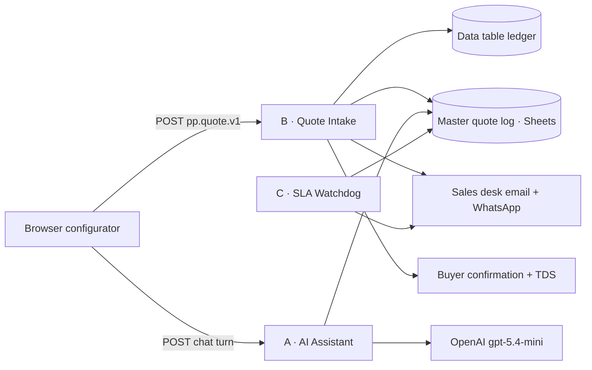

# 2 · n8n backend architecture

*Three workflows: quote intake, AI assistant backend, SLA watchdog. Built with the n8n Workflow SDK, validated locally and against the live instance, exported as importable JSON in [`n8n/workflows/`](../n8n/workflows).*

---

## 2.1 Principles

The SocietyVision pipeline (webhook → normalize → fan out to Sheets + branded email, pilot recipient until the client signs) is the starting point. Four rules were added, because a lost masterbatch inquiry costs more than a lost demo lead:

1. **Persist before you notify.** The lead is written to storage before a single email is composed. Gmail being slow or down can never lose a request.
2. **Respond before side effects.** The browser gets its 200 (with the reference and the SLA due time) as soon as the lead is durable. The buyer never waits on Google.
3. **Idempotent by submission id.** The browser retries on network failure; the workflow recognises a replay and answers `duplicate: true` instead of creating a second row and a second email.
4. **Degrade, never drop.** Every external call has an explicit failure path that still ends with the buyer informed and the desk notified.

## 2.2 Workflow B — Quote Intake (33 nodes)

`POST /webhook/pure-polymers/quote` · responds via Respond-to-Webhook · CORS limited to purepolymers.net, the GitHub Pages demo origin and localhost:8787.

### Node sequence

| # | Node | Type | What it does | Failure behaviour |
|---|---|---|---|---|
| 1 | Quote Webhook | Webhook 2.1 | Receives `pp.quote.v1`; bots ignored | — |
| 2 | Validate & Normalize | Code | Type-checks and length-caps every field, scores the lead, resolves the route, computes the SLA due time on the Saudi desk calendar, flattens 37 sheet columns | Produces `valid:false` + errors rather than throwing |
| 3 | Payload Valid? | If | Gate | Invalid → node 4 |
| 4 | Respond · Rejected | Respond | 422 with the field errors; **honeypot hits get a silent 200** so bots learn nothing | — |
| 5 | Find Prior Submission | Data table (get) | Looks up `submission_id` | `alwaysOutputData` + continue on error → treated as "not seen" |
| 6 | Already Logged? | If | Duplicate detection | Duplicate → node 7 |
| 7 | Respond · Duplicate | Respond | 200 `{ ok, duplicate: true, reference }` | — |
| 8 | Write Ledger Row | Data table (insert) | Durable copy of the whole lead, including `payload_json` | 3 retries |
| 9 | Sheet Row | Set (raw) | Emits the flat 37-column row | — |
| 10 | Append to Master Quote Log | Sheets (append) | The sales team's working surface | 3 retries, then **error output** |
| 11 | Respond · Logged | Respond | 200 `{ ok, reference, receivedAt, quotationDueAt, team, storage:'sheet' }` | — |
| 12 | Alert Ops · Sheet Write Failed | Gmail | Sends ops the row as JSON to paste | continue on error |
| 13 | Respond · Logged (ledger) | Respond | 200 with `storage:'ledger'` — the buyer is still confirmed | — |
| 14 | Route by Product Family | Switch 3.4 | `color_pigment` / `additive` / `compound` / **fallback → Unclassified** | Fallback output is wired, never dropped |
| 15–18 | Route · Color Lab / Additives Desk / Compounding Team / Sales Triage | Set | Team name, recipients, email variant, and a desk-specific instruction ("confirm dosage for the stated polymer…") | — |
| 19 | Compose Sales Alert | Code | Tier badge, score, SLA, full spec, one-tap reply / WhatsApp / open-log buttons | — |
| 20 | Send Sales Alert | Gmail | To the routed desk (pilot: to us) | continue on error |
| 21 | Hot Lead? | If | `tier === 'HOT'` | — |
| 22 | WhatsApp Ping · Hot Lead | WhatsApp Cloud | Template ping to Fahad — **disabled** until a template is approved | disabled + continue on error |
| 23 | Read TDS Library | Sheets (read) | `TDS_Library` tab: product id → Drive file id | `alwaysOutputData` so an empty library cannot block the email |
| 24 | Resolve TDS Files | Code | Matches products to files; **always emits exactly one item** | — |
| 25 | Has TDS on File? | If | Branches | — |
| 26 | Split TDS Files | Split Out | One item per data sheet | — |
| 27 | Download TDS | Drive (download) | Binary `data` | continue on error → that file is simply not attached |
| 28 | Bundle TDS & Compose Buyer Email | Code | Merges binaries, builds the branded HTML | — |
| 29 | Attachments Ready? | If | Chooses the Gmail node | — |
| 30–31 | Send Buyer Confirmation (+ TDS) | Gmail | The anti-ghosting email | continue on error |
| 32–33 | Sticky notes | — | Setup and intent, on the canvas | — |

### Lead scoring (node 2)

| Signal | Points |
|---|---|
| Annual volume | `<5 t` 5 · `5–25` 15 · `25–100` 30 · `100–500` 40 · `>500` 45 · unknown 8 |
| Timeline | urgent 25 · this month 18 · this quarter 10 · planning 4 |
| Company email domain | +10 |
| Phone on WhatsApp | +5 |
| Two or more spec answers | +5 |
| Target price or benchmark grade given | +5 |

`HOT ≥ 65 · WARM 40–64 · NURTURE < 40`. The tier drives the subject line, the WhatsApp ping and how the desk triages a busy morning.

### Storage schema

**`pp_quote_ledger`** (n8n data table): `submission_id`, `reference`, `received_at`, `route`, `tier`, `email`, `company`, `payload_json`. Two jobs: idempotency key and dead-letter copy.

**Master quote log** (Google Sheets, tab `Quote Log`), 37 columns: `received_at, reference, status, tier, score, route, team, sla_due_at, company, contact_name, role, email, phone, whatsapp, preferred_channel, language, products, product_ids, specs, polymers, process, market, final_product, annual_volume, first_order, timeline, sample, delivery_country, delivery_city, incoterm, target_price, benchmark, notes, source_page, utm, prefilled_by, submission_id`.

**`TDS_Library`** tab: `product_id, product_name, tds_file_id, tds_file_name, version, updated_at` — sales can add a data sheet without touching the workflow.

**`Assistant_Events`** tab (written by workflow A): `timestamp, session_id, event, reason, urgency, products, polymers, process, volume, timeline, summary`.

### Failure matrix

| What breaks | Buyer sees | Desk sees | Lead status |
|---|---|---|---|
| Sheets append fails | Normal confirmation (`storage: ledger`) | "Quote log write failed" with the row as JSON | Safe in the ledger |
| Gmail (buyer) fails | Confirmation page + reference already on screen | Sales alert still arrives | Safe |
| Gmail (desk) fails | Nothing | Buyer email still sent; execution logged | Safe |
| Drive/TDS missing | Email arrives, promises the TDS with the quotation | `missing[]` recorded | Safe |
| Whole webhook unreachable | "Saved on this device — retrying", WhatsApp fallback offered | — | Held in the browser outbox, re-sent automatically |
| Buyer double-submits | Same reference, `duplicate: true` | One row, one email | Safe |

## 2.3 Workflow A — AI Assistant backend (16 nodes)

`POST /webhook/pure-polymers/assistant` → `{ ok, reply, actions[], assistantMessage, meta }`

| # | Node | What it does |
|---|---|---|
| 1 | Assistant Webhook | Receives `{ sessionId, language, messages[] }` in OpenAI chat format |
| 2 | Guard & Build Request | Validates the transcript **without rewriting it**, caps size and turns, then builds the Chat Completions request (frozen system prompt + tool schemas + `parallel_tool_calls: false`). Returns a `promptFingerprint` so a corrupted deploy is detectable |
| 3 | Blocked? | Structural problem or turn cap → deterministic WhatsApp handoff |
| 4 | Call OpenAI | HTTP Request, `neverError` + `fullResponse` so the Code node owns the error policy |
| 5 | Shape Reply | Extracts text and tool calls, drops malformed or unknown calls, classifies failures, and flags a missing written answer |
| 6–9 | Retry Needed? → Back Off 2s → Call OpenAI (retry) → Shape Reply (final) | One bounded retry for 429/5xx and truncated answers; attempt 2 can never request a third |
| 10–12 | Written Answer Missing? → Call OpenAI (written answer) → Attach Written Answer | The deterministic backstop for the GPT-5 habit of answering with a tool call and no prose. Replays the cached prefix with `tool_choice: "none"` so the model can only write |
| 13 | Respond to Browser | Single response shape for every path |
| 14–15 | Conversion Event? → Log Assistant Event | Logs `open_quote_form` / `handoff_to_whatsapp` to `Assistant_Events` **after** responding |
| 16 | Sticky note | The architecture summary on the canvas |

Why an HTTP Request node rather than the AI Agent node: the assistant's tools are *UI
actions* that must reach the browser (prefill the form, render product cards, offer
WhatsApp). The AI Agent node executes tools server-side and returns only text. Owning the
request also makes `parallel_tool_calls`, the cached prefix and the written-answer
backstop possible — see [`docs/03-ai-agent.md`](03-ai-agent.md).

## 2.4 Workflow C — SLA Watchdog (5 nodes)

Schedule (cron `0 0 8,12,16 * * 0-4`, workflow timezone Asia/Riyadh) → read the quote log → Code → Gmail.

The confirmation page promises a quotation within two business days. This workflow is what makes that promise safe to print: it emails only when a row with status `New`/`In review` is past its `sla_due_at`, plus a 24-hour digest on the 08:00 run. Nothing overdue → **zero items → no email**. Changing a row's status to anything else stops the reminder.

## 2.5 Deployment status

All three workflows are **deployed and published** on `oussama19.app.n8n.cloud`, project
*Futuristic Life*, timezone Asia/Riyadh:

| Workflow | ID | Production URL |
|---|---|---|
| A — AI Assistant | `qjusXfa4s6nMk8sf` | `POST /webhook/pure-polymers/assistant` |
| B — Quote Intake | `2XVrv6uNq2DzvDgX` | `POST /webhook/pure-polymers/quote` |
| C — SLA Watchdog | `xmMGPr88vuDzanvq` | schedule only |

Backing resources: data table `pp_quote_ledger`, master spreadsheet
`1DUd4fQiYWlL86c7_Io0GjQ2oM6u8vcK99Bkw9xXs3ks` (tabs *Quote Log*, *TDS_Library*,
*Assistant_Events*), credentials for Google Sheets, Gmail, Google Drive and OpenAI.

### Verified against the live endpoints

| Check | Result |
|---|---|
| Real submission through the production webhook | HTTP 200 in 4.7 s — ledger row, sheet row, sales alert, buyer confirmation |
| Same `submissionId` sent twice | `{"duplicate": true}` in 0.35 s, no second email, no second row |
| Honeypot field filled | HTTP 200, nothing stored, nothing sent |
| Bot user agent (`curl`) | 403 — `ignoreBots` rejects it; a browser user agent gets 200 |
| Empty `TDS_Library` | Buyer confirmation still sent, without attachments |
| Assistant turn | Prose + product cards, correct volume conversion (5 t/month → `25-100`) |
| Regulatory question | Refused to claim approval, handed off, logged the conversion |
| Deployed prompt integrity | `promptFingerprint` matches the build |

### Remaining before Pure Polymers uses it for real

1. Upload the TDS PDFs to Drive and fill the `TDS_Library` tab (until then the buyer email
   ships without attachments, by design).
2. Set `CONFIG.mode` to `'live'` in *Validate & Normalize* and *Scan SLA* once the desk
   addresses are confirmed. Until then the new-quote alert goes to `demoRecipient`
   (Fahad) with `demoBcc` (OussamaLabs) on the bcc line, infrastructure failures go to
   `opsRecipient` only, and the buyer's confirmation always goes to the buyer.

   **One deployment detail:** on the live instance the *Send Sales Alert* node carries the
   demo recipient as a mode-aware expression on the node itself, rather than reading it
   from `CONFIG`. Behaviour is identical and it still hands over to the routed desks when
   `mode` becomes `live`; re-importing `n8n/workflows/pp-b-quote-intake.json` replaces the
   override with the config-driven version in this repo.
3. Confirm the routing addresses (`sales.color@`, `technical@`, `compounds@`).
4. Optional: WhatsApp Business template for the hot-lead ping (node present, disabled).
5. Optional: an error workflow (Error Trigger → Gmail) selected in each workflow's settings.

### Rebuilding from source

`node n8n/build.mjs` regenerates `n8n/sdk/*.workflow.ts` and `n8n/workflows/*.json` from
the Code-node sources and the catalog. Import the JSON in n8n and rebind credentials, or
apply the changed nodes in place.

## 2.6 Testing

`node n8n/test/run-code-nodes.mjs` runs every Code node outside n8n against a payload produced by the **frontend's own** `buildPayload()` — so the browser and the backend cannot drift apart silently. 72 assertions cover scoring tiers, the honeypot, the 422 path, the empty-TDS path, transcript validation, the retry classifier, refusal handling and the watchdog's silence. It also writes `n8n/previews/*.html` so the emails can be reviewed in a browser before anything is sent.

## 2.7 Roadmap

- **Status write-back.** When the desk sends a quotation, update the row status — one Gmail-trigger workflow, and the watchdog goes quiet automatically.
- **Quotation PDF.** The specification is already structured; generating a branded PDF quotation from the same row is a small step.
- **Arabic email variant.** `contact.language` already travels with the payload.
- **CRM.** When Pure Polymers outgrows Sheets, the ledger row is the natural migration point; nothing else changes.
